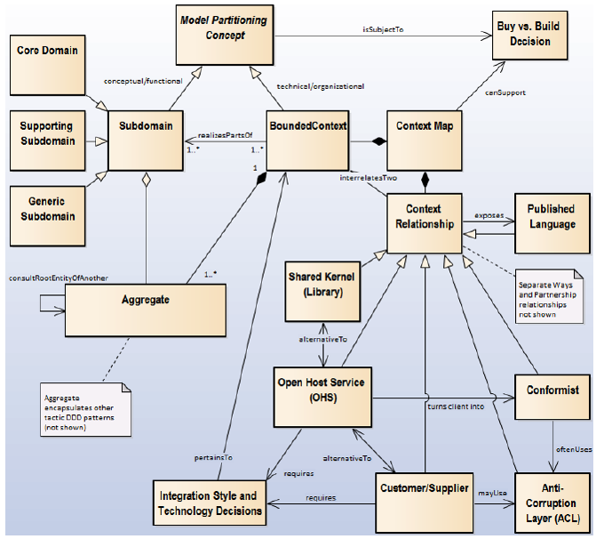
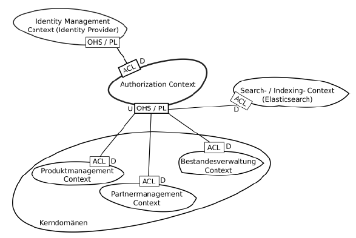
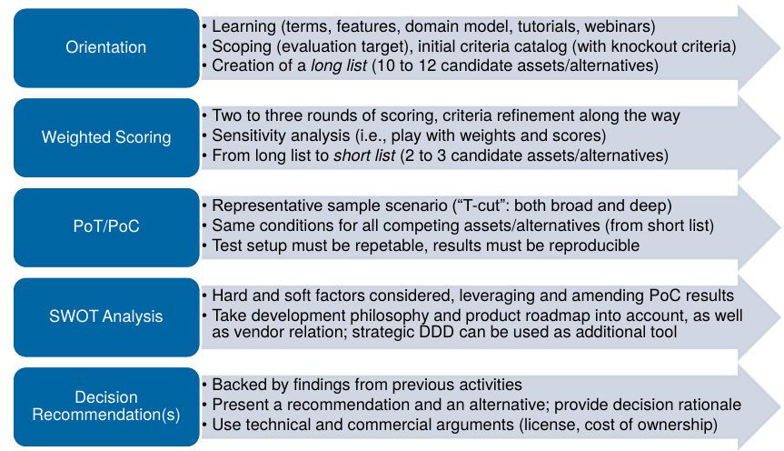

# Strategic DDD / Buy vs. Build

## Tactic DDD update
- Aggregates können auch Events austauschen (Message Queue System)

## Aggregate Best Practices
- Aggregates kommunizieren asynchron (mit MQ) miteinander
- Aggregates sollen separat deploybar sein
- Keine verteilten Transaktionen

## Bounded Context
- "Beschränkter" Context (Boundary)
- Meist ein Subsystem oder die Arbeit eines Teams
- Innerhalb der Boundary soll z.B. "ubiquitous" language gelten
- Grenzen sind eindeutig und explizit definiert

## Subdomain Pattern
- Die ganze Problemdomäne aufteilen in Subdomains
    - Funktionale Anforderungen aufteilen
- SE2: Partitioning vom Domain Model
- Die Lösungsdomäne (design-level domain model) in bounded Contexts aufzuteilen
- Unterschied zum Bound Context: 
    - BC ist im Solution Space, Subdomains im Problem Space
    - Subdomains sind im Logical / Scenario Viewpoint angesiedelt, Bounded Contexts im Viepoint Implementation / Process
- In "idealer" Welt Mappen Subdomains und BCs 1:1
    - Realität eher n:m, eine Subdomain kann z.B. in mehreren BC vorkommen

## Context Map Pattern
- Technik, um Bounded Contexts zu verbinden und die Beziehungen dazwischen zu verbinden
- Den Beziehung einen Typ zuweisen
    - Die Typen unterscheiden sich in Sachen Einfluss (coupling) und (a)symmetrie
- *Published Language*: Die BCs einigen sich auf eine gemeinsame Sprache, z.B. ein XML-Schema über einen ESB, über die sie interagieren können
- *conformist*: Ein BC "folgt" einem Anderen, hat keinen Einfluss auf das Interface des anderen BC
- *partnership*: Einigung, gemeinsame Aggregates zwischen BCs
- *shared kernel*: Gemeinsamer Kernel (z.B. library) - enge Kopplung
- *Open Host Service*: z.B. Offene API mit Doku, kann von jedem anderen BC verwendet werden (Published Language wird "exposed")
- *Customer/Supplier*: Customer kann Interface auch beeinflussen
- *Anti Corruption Layer*: Adapter implementieren, um sich vor Änderungen des Interfaces zu schützen

Lesen als z.B. "Authorization Context ist OHS für Produktmanagement Context"

!!! info
    Context-Map Aufgabe (oder ähnliche) kommt oft in Prüfung!

## Buy vs. Build

### PoT - Proof of Technology
- Scope kleiner als bei PoC
- Soll nur zeigen, dass eine Technologie oder Library funktioniert, wie sie soll
- Nicht auf das konkrete Projekt bezogen