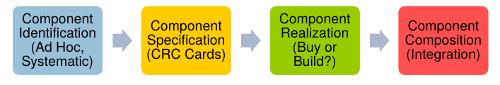
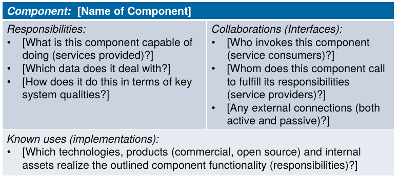

# Component Modeling / Reference Architectures
## Container Diagram
- Container Diagram zeigt eine höhere Abstraktionsebene als das Komponenten-Diagramm
    - Jeder Container ist sepparat "deployable", z.B. Fileserver, file system, web app
- Jeder Container kann in einzelne Components unterteilt werden

## Component Modeling
- In frühen Phasen werden Komponenten erst temporär festgelegt, Komponenten heissen hier "candidate components"
- Buy vs. build (kann auch OS-Funktion wie Cron sein)

### Component Identification
- Kandidaten identifizieren
    - Für jede Rolle (Actor) im System eine Channel-Komponente
    - Für jedes Features pro Layer eine Komponente (z.B. `NumberPortingPresenrtation`)
- CRC brainstorming
    - Für jede Komponente Responsibilities und Collaborators (Interfaces) aufschreiben
    - Ausserdem: Welche Technologien können eingesetzt werden, was kann als Vorlage / Inspiration genommen werden?
- Refactoring
    - z.B. Split / Merge Components
    - NFA / Implementation beachten (erst jetzt)
    - Mögliche Technologien
- *Components* pro Viewpoint
    - *Candidate Components* sind auf dem logischen Viewpoint und gruppieren mehrere Requirements
    - *Implementation Components* sind auf dem Development-Viewpoint und sind z.B. mehrere Klassen in OO
    - *Deployment Components* sind auf dem Physical Viewpoint und gruppieren Implementation Components in separat deploybare Einheiten

## Architectural Styles
- Analog Gebäude-Architektur (Gothisch, Romanisch)
- z.B. "client/server", "Layering"
