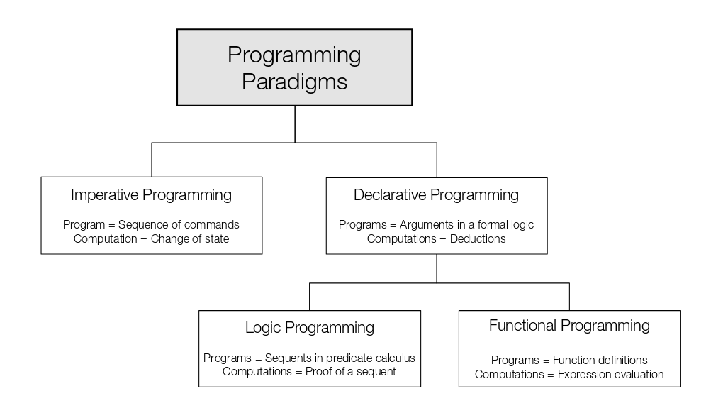

# Introduction
## Motivation
- Using a formal language to describe and solve problems is central to software engineering
- Programming language theory involves mathematics, software engineering and linguistics
- Main emphasis: Comparative programming language analysis
- Like in other engineering disciplines, a mathematical analysis can contribute to a reliable and robust design

## Definitions
- Formal language: Set of strings (symbols) constrained by specific rules
    - The set of formal languages is a subset of context-free languages
    - All programming languages are formal, we need to be able to interpret them computationally
- Informal language: Any natural language

## Goals
- Understanding of programming paradigms outside OO/imperative
- Create programs in functional and logical styles
- Formal foundations of programming languages
- Bridge the gap between "computer science" and theoretical disciplines and practical software engineering
- Shift from execution-based thinking to rule-based thinking

## Programming Paradigms
- OOP is not a paradigm in this sense here, more a way of organizing your code (built on the imperative paradigm)

